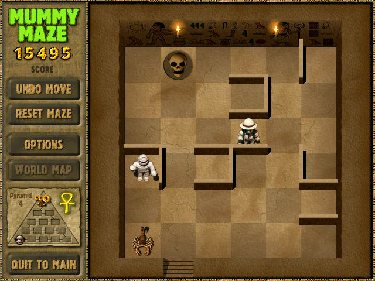

# WinMM-Helper

一个专为特定游戏（WinMM）设计的Windows内存修改工具，提供实时的内存地址监控和修改功能。



## 📋 项目简介

WinMM-Helper 是一个基于Windows API开发的内存修改工具，主要用于：

- 实时监控游戏进程内存
- 修改游戏角色和怪物的坐标位置
- 提供坐标锁定功能，防止意外修改
- 支持多种游戏实体的同时操作

## ✨ 主要功能

### 🎮 游戏支持

- 支持特定游戏的内存地址访问
- 自动检测游戏进程状态
- 实时显示连接状态

### 🎯 坐标修改

- **角色坐标修改**：实时修改玩家角色的X/Y坐标
- **怪物坐标修改**：支持多个怪物的坐标修改
  - 怪物1坐标控制
  - 怪物2坐标控制
  - 蝎子坐标控制

### 🔒 锁定功能

- 坐标锁定：防止坐标被意外修改
- 实时监控：持续检测并恢复锁定的坐标值
- 手动刷新：支持手动刷新内存数据

### 🖥️ 用户界面

- 侧边栏导航：分类管理不同功能模块
- 实时状态显示：显示进程连接状态
- 直观的控制面板：每个功能模块都有独立的操作界面

## 🛠️ 技术特性

### 内存操作

- 多级指针解析
- 安全的内存读写操作
- 地址有效性验证
- 进程权限管理

### 系统集成

- Windows API集成
- 进程注入技术
- 实时监控机制
- 异常处理机制

## 📦 安装说明

### 系统要求

- Windows 10/11 (64位)
- Visual Studio 2019或更高版本（用于编译）
- 管理员权限（用于内存访问）

### 编译步骤

1. 克隆项目到本地

```bash
git clone https://github.com/your-username/WinMM-Helper.git
cd WinMM-Helper
```

2. 使用Visual Studio打开解决方案文件

```bash
WinMM helpKit.sln
```

3. 选择Release配置并编译
4. 编译完成后，可执行文件位于 `Release/` 目录

### 预编译版本

项目提供了预编译的可执行文件：

- `Release/WinMM helpKit.exe` - 主程序

## 🚀 使用方法

### 基本操作

1. **启动程序**：以管理员身份运行 `WinMM helpKit.exe`
2. **连接游戏**：确保目标游戏正在运行
3. **选择功能**：使用侧边栏选择要操作的功能模块
4. **修改坐标**：在相应的面板中输入新的坐标值
5. **锁定功能**：使用复选框锁定特定坐标

### 功能模块说明

#### 角色控制

- 修改玩家角色的X/Y坐标
- 实时显示当前坐标值
- 支持坐标锁定

#### 怪物控制

- 分别控制多个怪物的位置
- 独立的坐标锁定功能
- 实时状态监控

#### 系统状态

- 显示进程连接状态
- 内存地址有效性检查
- 错误提示和警告

## ⚠️ 注意事项

### 使用风险

- 本工具仅用于学习和研究目的
- 使用内存修改工具可能违反游戏服务条款
- 请确保在合法且安全的环境中使用

### 系统兼容性

- 仅支持特定的游戏版本
- 需要管理员权限运行
- 可能与某些安全软件冲突

### 技术限制

- 内存地址可能因游戏版本更新而改变
- 需要目标游戏进程正在运行
- 某些反作弊系统可能检测到工具使用

## 🔧 开发信息

### 技术栈

- **语言**：C++
- **框架**：Windows API
- **IDE**：Visual Studio 2019+
- **构建系统**：MSBuild

### 项目结构

```
WinMM-Helper/
├── WinMM helpKit.cpp      # 主程序文件
├── WinMM helpKit.h        # 头文件
├── WinMM helpKit.rc       # 资源文件
├── framework.h            # 框架头文件
├── targetver.h            # 目标版本头文件
├── game/                  # 游戏相关文件
│   ├── 木乃伊.rar         # 游戏文件
│   └── 游戏说明.txt       # 游戏说明
└── Release/               # 编译输出目录
    └── WinMM helpKit.exe  # 可执行文件
```

### 内存地址配置

项目使用预定义的内存偏移常量：

- 基础地址偏移：`0xAC54C`
- 多级指针偏移配置
- 支持角色、怪物1、怪物2、蝎子的坐标控制

## 📄 许可证

本项目仅供学习和研究使用。使用者需要自行承担使用风险。

## 🤝 贡献

欢迎提交Issue和Pull Request来改进项目。

## 📞 联系方式

如有问题或建议，请通过GitHub Issues联系。

---

**免责声明**：本工具仅供学习和研究使用。使用者需要遵守相关法律法规和游戏服务条款，开发者不承担任何因使用本工具而产生的责任。
